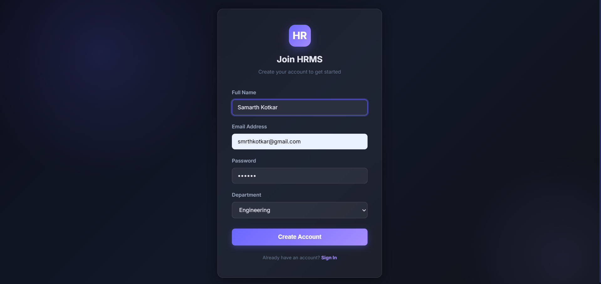
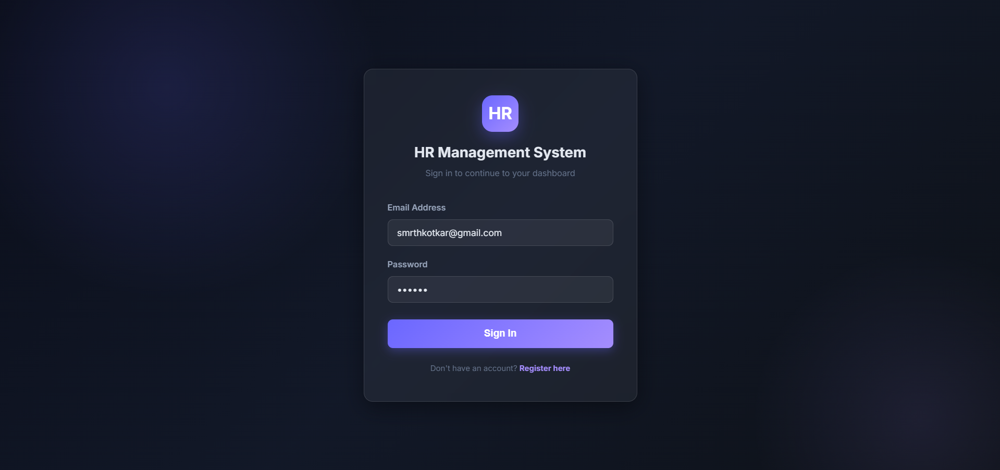
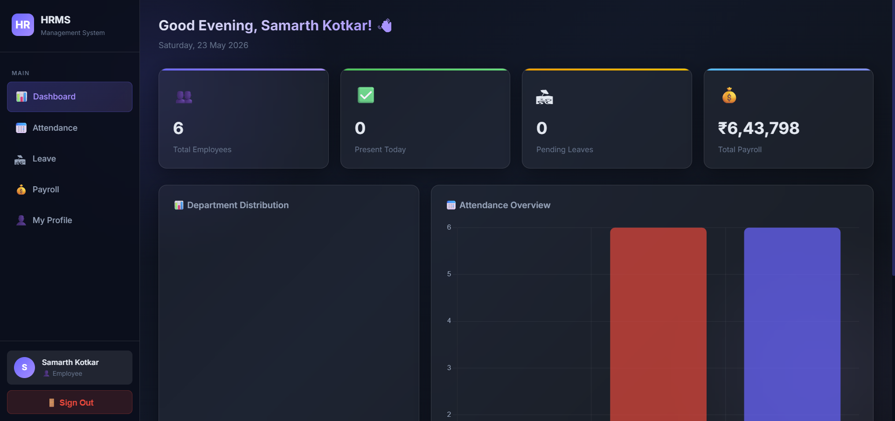
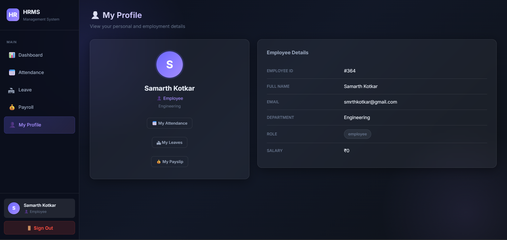
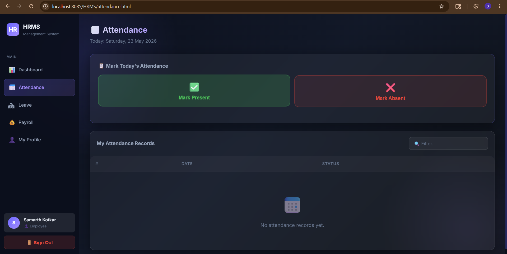

# HR Management System

## Project Overview
This is a Human Resource Management System (HRMS) developed using Java and MySQL.

## Features
- Employee Management
- Attendance Management
- Payroll Management
- Admin Dashboard
- Database Connectivity

## Technologies Used
- Java
- JDBC
- MySQL
- HTML
- CSS
- JavaScript

## Author
Samarth Kotkar

## Screenshots

### Registration Page

### Login Page

### Dashboard

### My Profile

### Attendance Page

